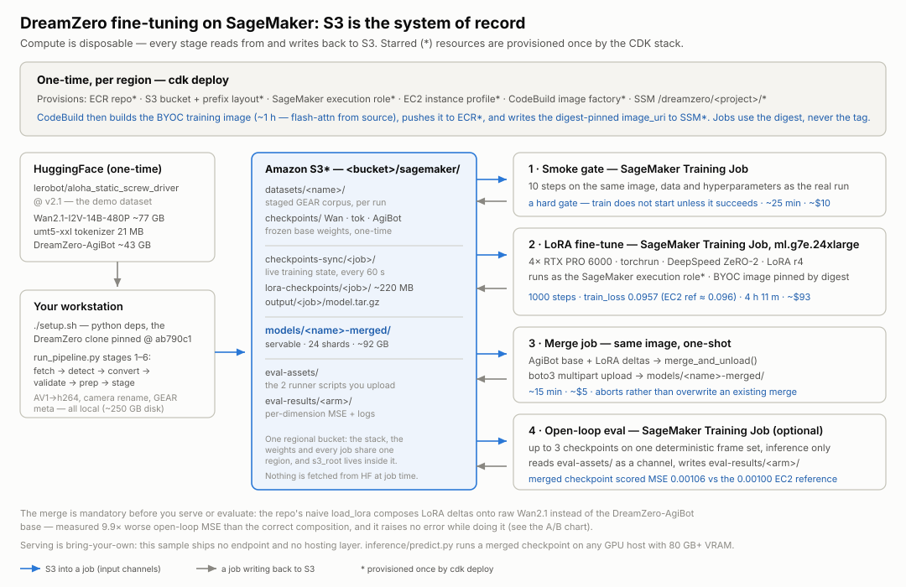
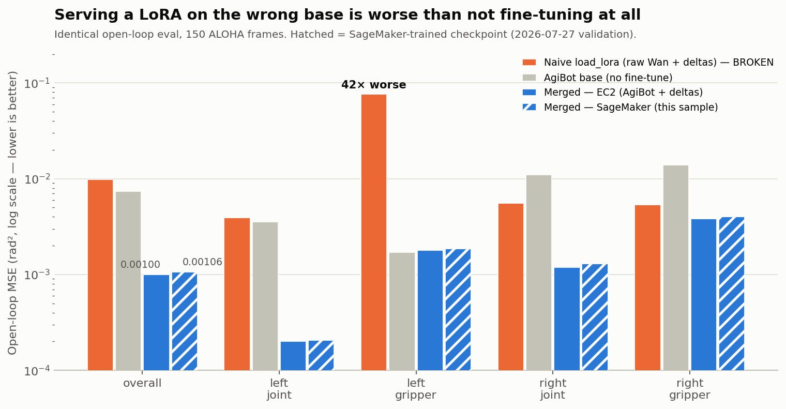

# Fine-tune DreamZero (World Action Model) on Amazon SageMaker

Fine-tune NVIDIA's [DreamZero](https://github.com/dreamzero0/dreamzero) — a 14B
video-diffusion World Action Model for robot manipulation — on your own
LeRobot-format dataset, as a SageMaker Training Job with a bring-your-own
container, and produce **servable merged weights in S3** with one command.



Validated end-to-end on the public `lerobot/aloha_static_screw_driver` dataset
(bimanual ALOHA robot): a 1000-step LoRA fine-tune on `ml.g7e.24xlarge`
(4× RTX PRO 6000 Blackwell) reproduced an EC2 reference run's final loss
(0.0957 vs ~0.096, ~$93 of compute), and the merged checkpoint matched the
reference open-loop accuracy (MSE 0.00106 vs 0.00100).

Read the story behind this sample — what we measured, and the failure modes
that only showed up with real money on the line — on [AWS Builder
Center](https://builder.aws.com/content/3Im0ezyNtOji0HQBCTwqwgkQ9VI/fine-tuning-a-nvidias-dreamzero-a-14b-world-action-model-on-amazon-sagemaker-what-it-actually-takes).

## What a first run costs and how long it takes

| Phase | Wall clock | Cost |
|---|---|---|
| `cdk deploy` + the CodeBuild image build | ~1 h, in the background | ~$12 |
| `./setup.sh --stage-assets` — one-time base weights | ~1–2 h (~128 GB / 119 GiB, downloaded then uploaded) | ~$3/month to store |
| Smoke job — 10 steps, the gate | ~25 min | ~$10 |
| 1000-step fine-tune — the shipped default | **4 h 11 m** | ~$93 |
| LoRA → base merge | ~15 min | ~$5 |
| **First servable checkpoint** | **~6–7 h** | **~$120** |

The image build is not free: it runs on a privileged
`BUILD_GENERAL1_2XLARGE`, which is **$0.20/build-minute** in us-east-1, and
compiling flash-attn from source is what makes it take the hour. Budget ~$12 per
build, once per region — not per run.

The first two rows are one-time per region, so a second run is the last three:
about 5 hours. Costs are measured; of the durations, **4 h 11 m and the merge are
wall-clock measurements** (the merge at 16 min on `ml.g7e.48xlarge`) and the
smoke row is derived from its measured cost at the same hourly rate.

The 1000 steps are a demo default, not a recommendation, and **compute is linear
in `training.max_steps`** — read [Costs](#costs-measured-in-us-east-1) before
raising it, because S3 also grows and never shrinks.

## What's here

```
cdk/         CDK app (Python): ECR repo, S3 bucket, SageMaker execution role,
             EC2 instance profile — everything durable, deployed once
docker/      BYOC image: SageMaker PyTorch 2.8 DLC + DreamZero + 8 critical
             environment fixes, and the training entrypoint
pipeline/    one-command pipeline: HuggingFace or local LeRobot dataset ->
             validate -> prep -> smoke gate -> fine-tune -> LoRA merge ->
             servable weights in S3; per-run knobs in ./project_config.json
             (repo root)
evaluation/  compare checkpoints (fine-tuned vs base) as a SageMaker job:
             deterministic frame set, per-key MSE, checkpoint-portability
             fixes built in — see evaluation/README.md
inference/   minimal predict.py: one observation -> action chunk from a
             merged checkpoint (see "Deploying this model" below)
dataset/     your local datasets go here (gitignored); the pipeline also
             downloads HuggingFace datasets into it — see dataset/README.md
docs/        SECURITY.md: scan results, what was fixed, and the hardening
             items left to you — read it before any non-sandbox deploy.
             DEPENDENCY-INVENTORY.md: pip-audit of the built image, with a
             reachability assessment per advisory
assets/      architecture diagram + measured result charts
```

## Prerequisites

- An AWS account with a **SageMaker training quota for the instance type in
  `project_config.json`** (`compute.*.instance_type`; the shipped default is
  `ml.g7e.24xlarge`). These quotas default to 0, so request early:

  ```bash
  # ml.g7e.24xlarge = L-E2612040, ml.g7e.48xlarge = L-BE072D49
  aws service-quotas request-service-quota-increase --service-code sagemaker \
      --quota-code L-E2612040 --desired-value 1
  ```

  Quota is not capacity: an approved quota does not mean the region has the
  instance, and **no free API tells you whether it does** —
  `describe-capacity-block-offerings`, `run-instances --dry-run` and
  spot-placement scores all answer a different question. The zero-cost probe
  is a **submitted SageMaker training job**: it queues as `Pending` and bills
  nothing until it gets hardware, so submit the smoke job *before* staging
  ~128GB of weights into a region. Capacity is region-local — if one region is
  dry, try another rather than waiting.

  `ml.p4de.24xlarge` (8× A100 80GB) is also validated with this image;
  `ml.p5.48xlarge` meets the 80GB-per-GPU bar but has not been run. The
  preflight reads the quota for whatever you configured, so a wrong request
  shows up before any money is spent.
- AWS CLI v2 with working credentials for the target account
- Node.js (for the CDK CLI) and **Python 3.9+**. The `model.tar.gz` extraction
  asks `tarfile` for the hardened `filter="data"` and falls back to a
  hand-rolled validation loop on `TypeError`, so it is safe on any 3.9+ — the
  filter itself was backported to 3.9.17 / 3.10.12 / 3.11.4, and only older
  patch releases take the fallback path. `setup.sh` installs the pipeline's
  deps with a plain `python3 -m pip`, so on PEP-668 distros (Ubuntu 23.04+,
  Debian 12+, Homebrew) run it inside an activated venv, or set
  `PIP_BREAK_SYSTEM_PACKAGES=1`
- **Docker is optional.** The CDK stack builds the training image in CodeBuild,
  so nothing in the documented path needs a local daemon. You only need Docker
  for `docker/build_and_push.sh`, the local-build alternative
- ~250GB local disk for the one-time base-weight staging
- The model needs **80GB+ VRAM per GPU** — 48GB GPUs (ml.g6e/L40S) will OOM.
  Measured on a 96GB card at `per_device_train_batch_size=1`, 33 frames × 3
  views: **~73GB per GPU**. So 80GB cards fit, but with little headroom, and
  raising the per-device batch is not the way to scale — use
  `global_batch_size` and let the trainer derive gradient accumulation (see
  [pipeline/README.md](pipeline/README.md#caveats))

## Quick start

Three commands, on the shipped ALOHA demo dataset:

```bash
export AWS_REGION=us-east-1 AWS_DEFAULT_REGION=us-east-1   # both; see below

# 1. Infrastructure, once per region. Also kicks off the ~1h training-image
#    build in CodeBuild, which runs in the background — the deploy returns.
npm install -g aws-cdk        # the CDK CLI (requirements.txt has only the library)
cd cdk && python3 -m venv .venv && . .venv/bin/activate
pip install -r requirements.txt && cdk bootstrap && cdk deploy
deactivate && cd ..

# 2. Python deps, the pinned DreamZero clone, wait for the image build, write
#    pipeline/pipeline_config.json, stage the base weights to S3 (one-time).
./setup.sh --stage-assets

# 3. Fetch + validate + prep the dataset, smoke gate, full run, merge.
python3 pipeline/run_pipeline.py --name aloha-demo
```

Output: servable merged weights at
`s3://<your-bucket>/sagemaker/models/aloha-demo-merged/`. Every step is
idempotent and safe to re-run, and `run_pipeline.py` opens with a read-only
**preflight** (credentials, image, base weights, GPU quota) that aborts with the
fixing command before any money is spent.

Four things to know before you start:

- **Export both region variables.** The CDK CLI reads `AWS_REGION`, boto3 reads
  only `AWS_DEFAULT_REGION`. Setting one of them sends the stack and the
  pipeline to *different regions* with no error at all (see
  [cdk/README.md](cdk/README.md)).
- **`--name` is just a label.** It names the S3 prefixes (`datasets/<name>/`,
  `models/<name>-merged/`) and the SageMaker jobs. It does not have to match
  anything inside the `dataset/` folder.
- **Confirm the merge happened.** Step 3 merges automatically as its final
  stage, but the driver is a local process and can die after training completes.
  `models/<name>-merged/` exists and is non-empty, or you are not done — see
  [The merge](#the-merge-the-one-step-you-must-not-skip).
- **Shared or sandbox account?** Scheduled cleanup tooling will stop a training
  job that is merely *queued* (it ends `Stopped`, no `FailureReason`). Put your
  account's exemption tag in `extra_job_tags` in
  `pipeline/pipeline_config.json` first. See
  [pipeline/README.md](pipeline/README.md#caveats).

The dataset defaults to `lerobot/aloha_static_screw_driver`. To train on your
own, see [Bring your own dataset](#bring-your-own-dataset).

## Configuration: three files, three jobs

| File | Owns | Written by |
|---|---|---|
| `pipeline/pipeline_config.json` | account infra: bucket, region, role, image, `extra_job_tags` | `cdk/generate_pipeline_config.py` |
| `pipeline/configs/*.yaml` | per-robot semantics: cameras, dim slices, fps | you, once per robot |
| `project_config.json` | per-run knobs: dataset source, compute, hyperparameters | you, per run |

`pipeline_config.json` is itself optional: any account value it doesn't
provide is resolved from `DREAMZERO_*` environment variables, then from the
SSM parameters the CDK stack writes (`/dreamzero/<project>/*` — the CodeBuild
image build keeps `image_uri` there current and digest-pinned). The file
remains the place for values with no other source, like `extra_job_tags`.

`project_config.json` is where you point the pipeline at your own dataset —
either a HuggingFace repo id (fetched automatically) or a local path — and
where instance types, volume sizes, runtimes, and training hyperparameters
live. The dataset source and step count also have CLI overrides
(`--hf-dataset`, `--dataset`, `--config`, `--max-steps`); compute and the
remaining hyperparameters are edited in the file.

`project_config.openarms.json` is a second worked example — a 16-dim bimanual
arm at 25fps, 5000 steps on `ml.g7e.48xlarge` — kept as a whole file so the
dataset, embodiment config, hyperparameters and instance types stay consistent
with each other. Pass it with `--project-config`:

```bash
python3 pipeline/run_pipeline.py --name my-run \
    --project-config project_config.openarms.json --stop-after smoke
```

It is `source: local` and points `dataset.local_path` at
`dataset/openarm_v21_150ep_25fps`, which **no clone ships** (`dataset/` is
gitignored) — so unlike the ALOHA default, this one is a template for your own
data. Put a LeRobot v2.1 tree there, edit `dataset` to your own path or repo id,
or pass `--dataset <your_tree>`; otherwise the run stops at the validation stage
with `ABORT: … is not a LeRobot dataset (no meta/info.json)`.

Two blocks are read from the repo-root `project_config.json` **only** and
ignore `--project-config`: `solution` (`pipeline/solution.py`) and `image.tag`
(`cdk/app.py`). That is deliberate — a per-run config cannot strip the release
identity — but it means those two values live in one place regardless of which
per-run file you pass.

## Bring your own dataset

Put your dataset in the repo's `dataset/` folder (contents are gitignored) and
pass `--dataset dataset/<name>`, or set `dataset.source: "local"` and
`dataset.local_path` in `project_config.json`. The pipeline accepts
any LeRobot dataset plus
an **embodiment config** — the per-robot semantics that cannot be inferred
(getting these wrong trains a broken model *without erroring*):

| Config field | Meaning |
|---|---|
| `camera_map` | source camera → view (top = scene, left/right = wrist); order is semantic |
| `state_keys` / `action_keys` | named slices of the packed state/action vector |
| `task_key` | language-annotation column |
| `fps` | dataset frame rate — cross-checked against the dataset's own meta to catch a config copied from another robot (see [pipeline/README.md](pipeline/README.md) for why the trainer itself doesn't consume it) |

`pipeline/configs/aloha_bimanual_14dim.yaml` is the validated default for
ALOHA-like 14-dim bimanual robots — copy and edit it.
`pipeline/configs/openarms_bimanual_16dim.yaml` is a second worked example
(16-dim, 7 joints + gripper per arm, 30 fps) showing how the slices and fps
change for a different bimanual robot, and
`openarms_bimanual_16dim_25fps.yaml` is its 25 fps variant for datasets
recorded at that rate.

### If your dataset is LeRobot v3

**Most `lerobot/*` repos now point `main` at a v3 tree**, so this is the first
wall most people hit. Two ways past it, cheapest first:

```bash
# 1. Many repos still tag the v2.1 tree — try this before writing anything
python3 pipeline/run_pipeline.py --name my-run --hf-dataset lerobot/<repo> \
    --hf-revision v2.1

# 2. Otherwise convert locally (no AWS needed), then point the pipeline at it
python3 pipeline/convert_lerobot_v3_to_v21.py dataset/my_robot_v3 dataset/my_robot
```

v3 aggregates episodes into shared files in ways that vary per dataset, so
`pipeline/convert_lerobot_v3_to_v21.py` is a **worked example, not a universal
converter**. It splits the aggregated parquets per-episode (grouping on
`episode_index`, so it handles both one-row-group-per-episode and
whole-dataset-in-one-row-group writers), cuts frame-exact per-episode videos,
normalizes the parquet dtypes to what v2.1's `info.json` declares, and writes
the v2.1 meta. It is verified on bimanual, 3-camera, 16-dim OpenArms v3 trees.

It maps the source cameras onto DreamZero's top/left/right by name and **prints
the mapping it chose** — read it, because camera order is semantic and a wrong
map trains a broken model without erroring. Pass
`--camera-map <source_key>=<target_key>` when the names don't say — **source
first**, and the source must be a full `dtype: video` feature key from your
tree's `info.json`, not a bare suffix, or the converter exits with
`--camera-map source key … is not a video feature`. The three targets are
fixed: `observation.images.{top,left,right}_camera-images-rgb`. So:

```bash
--camera-map 'observation.images.cam_front=observation.images.top_camera-images-rgb,…'
```

Note the embodiment config you pair with the output uses the
*renamed* cameras (an identity `camera_map`), not the source names.

For a materially different v3 layout, adapt that script's split/cut logic.
Alternatively the pipeline can run your converter inline during the convert
stage (`{src}` = the raw v3 tree, `{dst}` = where to write the v2.1 output):

```bash
python3 pipeline/run_pipeline.py --name my-robot-v1 \
    --v3-converter 'python3 pipeline/convert_lerobot_v3_to_v21.py {src} {dst}'
```

### Datasets that are already GEAR-prepped

Datasets that ship `meta/modality.json` + `meta/relative_stats_dreamzero.json`
(like NVIDIA's published DreamZero/GR00T datasets) use a minimal config —
`format: gear` plus `recipe` and `fps` — and the pipeline skips the
convert/prep stages, validates against the dataset's own modality.json, and
stages it to S3 as-is. See `pipeline/configs/droid_franka_oxe.yaml`.

### Validation runs before any compute

A **validation stage** checks your config against the actual dataset: slice
bounds vs the real state/action dims, camera names, fps agreement, that every
episode listed in `meta/episodes.jsonl` actually has its files on disk, and an
action-vs-state scan. See the next section for why that last one matters.

### Holding out episodes for a real generalization number

The evaluation command in [Evaluating the result](#evaluating-the-result)
measures fit on the episodes the model trained on. For a held-out number, split
the dataset *before* running the pipeline:

```bash
python3 pipeline/split_dataset.py --src dataset/my_robot \
    --holdout 0,17,42 \
    --train-dst dataset/my_robot_train --holdout-dst dataset/my_robot_eval
```

Run the pipeline on `_train`, then take the holdout as far as the staging step
only (`--name my-robot-eval --stop-after stage`) and point `--dataset-s3` at
that prefix. Episode indices are renumbered contiguously in both outputs, and
`meta/split_manifest.json` records the mapping. Three rules:

- **Use fresh `--name`s** for the re-run — the staging step syncs
  `datasets/<name>/` with `--delete` and the prep step clears its local work
  directory for that name first, so reusing a previous run's name replaces
  that run's staged corpus in both places.
- **Split the original LeRobot v2.1 tree**, not a prepped/staged output — the
  splitter carries only v2.1 metadata.
- A holdout is **post-training only**: the trainer never evaluates mid-run
  (checkpoints are kept by recency, there is no eval loop to hook), so the
  split feeds the evaluation job, not checkpoint selection. For a three-way
  train/val/test split, carve the combined val+test pool out of the *original*
  dataset first, then split that pool — after the first pass the episode
  indices are renumbered, so a second pass over the train output would silently
  hold out different episodes than you named.

## Five ways to silently train a broken model

Each of these produces a job that ends `Completed`, a loss curve that looks
healthy, and a policy that learned the wrong thing. They are why the pipeline
has a validation stage and a smoke gate at all.

| Mistake | What catches it |
|---|---|
| **1. Camera order wrong** in `camera_map` — order is semantic (top = scene, left/right = wrist) | Nothing automatic. The v3 converter prints the mapping it chose; read it. |
| **2. `state_keys` / `action_keys` slices wrong** — the packed vector is mis-sliced | Validation stage, against the dataset's real dims. |
| **3. `action == state`** — labels are a copy of the measured state, a common data-collection bug. Open-loop MSE then looks *excellent*, because a model that echoes its input scores perfectly | Validation stage warns, or fails with `validation.fail_on_action_equals_state`. |
| **4. Video frames misaligned with parquet rows** — e.g. a re-encode that dropped frames. Frame *i* must correspond to row *i*, because the decord backend maps parquet timestamps onto video PTS | Validation checks that every listed episode has its files; frame-exactness is on you and your converter. |
| **5. Serving the raw LoRA directory** instead of the merged weights — measured **9.9× worse** than correct, and worse than not fine-tuning at all | Nothing automatic. See [The merge](#the-merge-the-one-step-you-must-not-skip). |

A sixth won't break the model but will cost you a day: setting only one of
`AWS_REGION` / `AWS_DEFAULT_REGION` puts the CDK stack and the pipeline in
**different regions**, silently.

## Running one stage at a time

`run_pipeline.py` is a single driver over nine stages, and every boundary
between them is a resume point. `--start-at` and `--stop-after` each take a
stage name, so any contiguous slice can be run on its own:

```
fetch → detect → convert → validate → prep → stage → smoke → train → merge
└─────── local (stage uploads to S3) ──────┘   └─ one SageMaker job each ─┘
```

The three right-hand stages are the ones that cost money. Preflight runs
whatever you start at, so a stale image, a missing base weight or a config
pointing at the wrong account or region stops the run before anything is
submitted.

Two properties are what make the slices independent:

- **`--name` resolves the S3 layout by itself.** The staged corpus is always
  `s3://<bucket>/sagemaker/datasets/<name>/` and the merged output is always
  `models/<name>-merged/`, so a later stage locates the earlier stage's output
  from the name alone — there is no state file to keep or pass along.
- **The local dataset is only dereferenced through `stage`.** Starting at
  `smoke` or later works on a machine that has never held the dataset, which is
  what lets you resume a run from a different workstation. (`stage` itself still
  uploads `prep`'s local output, so it needs `prep` to have run on *that*
  machine — `--start-at stage` on a fresh box fails in `aws s3 sync`.)

Add `--project-config project_config.openarms.json` to any command below to use
the second worked example's dataset, compute and hyperparameters instead of the
repo-root defaults.

### The smoke test alone

The cheapest full-stack proof there is: the same container, hyperparameters,
dataset and embodiment config as the real run, for a handful of steps (~$10,
~25 min). Worth running after any change to the image, the config, the dataset
or the region.

```bash
# local stages + the smoke job, then stop
python3 pipeline/run_pipeline.py --name aloha-demo --stop-after smoke

# the smoke job only, against a corpus already staged under this --name
python3 pipeline/run_pipeline.py --name aloha-demo \
    --start-at smoke --stop-after smoke
```

`compute.smoke` in the project config owns the step count and instance type.
Set `compute.smoke.save_steps` below `steps` (e.g. `steps: 30`,
`save_steps: 10`) if you want the gate to exercise *mid-run* checkpoint saves
and not just the final one — a checkpoint-sync permission problem otherwise
stays hidden until the real run.

Read the seconds/step off this job and project the full run before committing
to it. Compute is linear in `training.max_steps`.

### The training job alone

`--start-at train` skips the local stages and the smoke gate and submits the
full run against the already-staged corpus. It logs the job name it submitted —
keep it, the merge stage needs it.

```bash
python3 pipeline/run_pipeline.py --name aloha-demo \
    --start-at train --stop-after train
```

Drop `--stop-after train` and the driver merges automatically once training
finishes, which is what you want unless you are deliberately splitting the two.
Three other flags matter here:

- **`--skip-smoke`** runs the local stages and then the full job in one command,
  with no gate.
- **`--max-steps N`** overrides `training.max_steps` for this run only.
- **`--spot`** runs the **train stage only** on managed spot
  (`EnableManagedSpotTraining` plus the required `MaxWaitTimeInSeconds`, set to
  2× the runtime cap so a reclaimed job has room to queue). Off by default, and
  the smoke gate and merge never use it. Preflight **refuses** `--spot` on an
  image below v11, because a reclaim relaunches the same job spec into the same
  checkpoint prefix — see [If a training job is
  interrupted](#if-a-training-job-is-interrupted). Expect queueing: after a real
  reclaim this recipe sat in `Starting` for 6.5 h waiting for capacity, billed
  nothing while it waited.
- **`--train-job <name>` together with `--start-at train` attaches** to a job
  that is *already running* rather than submitting another one: the driver
  waits on it, then merges. That is the correct response to a lost terminal on
  a multi-hour run — re-issuing the launch command instead pays twice and puts
  two writers into the same checkpoint prefix.

### The merge job alone

```bash
python3 pipeline/run_pipeline.py --name aloha-demo \
    --start-at merge --train-job dz-aloha-demo-1000s-<timestamp>
```

`--train-job` is mandatory here and the stage aborts telling you so if you omit
it. **Why this stage exists, what it refuses to do, and how to confirm it
worked** are all in [The merge](#the-merge-the-one-step-you-must-not-skip) —
read that before you serve anything.

### If a training job is interrupted

The image mirrors `$OUT` to `checkpoints-sync/<job>/` every 60 seconds and, at
start-up, **restores the newest *complete* checkpoint from that prefix back into
`$OUT`** — so a job that starts again under the same name resumes instead of
retraining from step 0. "Complete" is checked, not assumed: one optimizer shard
per GPU on this instance, plus `latest`, `trainer_state.json` and `scheduler.pt`,
with every size cross-checked against the S3 listing to catch a save that was
mirrored mid-write.

Two things worth being precise about:

- **This launcher submits on-demand jobs, and SageMaker never relaunches one.**
  So on the shipped path the restore is a safety net you will not normally reach:
  it matters if you submit with `EnableManagedSpotTraining` yourself, or point
  `CKPT_S3_URI` at an earlier run's prefix to continue it.
- **It is not just a cost saver.** A same-name relaunch reuses the same prefix,
  and the bucket is not versioned, so a from-scratch attempt overwrites the
  better-trained checkpoints it should have resumed from. That is why the restore
  refuses to start when it cannot list the prefix, when its selector crashes, or
  when a download arrives incomplete — a failed job costs minutes, and a silent
  step-0 restart once destroyed ~$480 of training before this existed.

Measured on a real spot reclaim: 26 files verified, resumed from step 7,500 in
155 s. Requires image **v11+** (`project_config.json` → `image.tag`); v10 restores
but has three known holes, and v9 has no restore at all — `run_pipeline.py`'s
preflight warns you which one you are on.

### Dry-run any of them first

`--dry-run` runs the local stages, prints every job spec it would submit, and
submits nothing. It composes with any `--start-at`, so it is a free way to
confirm the output prefix, instance type and runtime cap before spending:

```bash
python3 pipeline/run_pipeline.py --name aloha-demo \
    --start-at merge --train-job dz-aloha-demo-1000s-<timestamp> --dry-run
```

## The merge: the one step you must not skip

The LoRA checkpoint that training produces is **not directly servable**. The
DreamZero repo's `load_lora` composes the adapters onto the raw Wan2.1 base
instead of the robot-pretrained DreamZero-AgiBot base they were trained
against — measured on identical evals, that path is **9.9× worse** on overall
MSE than the correct composition, and worse than not fine-tuning at all:



The 9.9× is the *overall* ratio (0.00998 vs 0.00100). The chart's **42×** is the
worst single action key, the left gripper — the same one-dimension effect the
caveats under [Evaluating the result](#evaluating-the-result) warn about, shown
here because it is where the wrong base does its real damage.

`run_pipeline.py` runs the merge as its final stage automatically. Serve the
weights from `models/<name>-merged/`, never the raw LoRA directory.

### Confirm it actually happened

The merge is the one stage that runs after a multi-hour wait, so it is the one
most likely to be orphaned: `wait_for_job` rebuilds its AWS session on every
poll and so survives a credential refresh, but the stages after it do not, and a
driver that dies there leaves a perfectly good set of checkpoints with no
servable weights. **The failure is quiet** — training shows `Completed` in the
SageMaker console and nothing says the merge is missing.

```bash
# empty output = not merged
aws s3 ls s3://<your-bucket>/sagemaker/models/aloha-demo-merged/

# the training job name, if you no longer have it
aws sagemaker list-training-jobs --name-contains aloha-demo \
    --query 'TrainingJobSummaries[].[TrainingJobName,TrainingJobStatus]' \
    --output table
```

Re-running the merge alone is cheap (~$5, ~15 min) and idempotent — see
[The merge job alone](#the-merge-job-alone).

### What the merge stage refuses to do

It prefers the training job's `model.tar.gz`, and if the job trained fine but
died in *finalization* and never produced one, it falls back to the newest
complete `checkpoint-<N>/` under `checkpoints-sync/<job>/` and logs which it
picked. Two refusals protect you: an incomplete checkpoint aborts up front
rather than partway into a paid GPU job, and a `models/<name>-merged/` that
already holds objects aborts rather than half-overwriting weights something may
be serving. Preflight runs again too, so a config pointing at a different
account or region than the training job stops here instead of merging nothing.

### Verifying a merge you didn't watch

The output is a full standalone model — 24 safetensors shards, ~85 GiB — not an
adapter. Its `config.json` is rewritten with `train_architecture: full` and
`defer_lora_injection: false`, which is precisely what stops a loader from
re-injecting the adapters onto raw Wan2.1 and walking into the trap above.

```bash
# every shard the index references, and nothing missing
aws s3 ls s3://<your-bucket>/sagemaker/models/<name>-merged/ \
  | grep -c 'model-.*\.safetensors$'                          # 24

# the rewrite that keeps a loader off the raw-Wan2.1 path
aws s3 cp s3://<your-bucket>/sagemaker/models/<name>-merged/config.json - \
  | python3 -c 'import json,sys; c=json.load(sys.stdin)["action_head_cfg"]["config"]; \
print(c["train_architecture"], c["defer_lora_injection"])'     # -> full False
```

## Evaluating the result

Compare the fine-tuned checkpoint against the AgiBot base on the same frames,
per-key MSE:

```bash
aws s3 cp evaluation/run_eval_in_job.sh  s3://<your-bucket>/sagemaker/eval-assets/
aws s3 cp evaluation/open_loop_eval.py   s3://<your-bucket>/sagemaker/eval-assets/
python3 evaluation/submit_eval_job.py \
    --dataset-s3 s3://<your-bucket>/sagemaker/datasets/aloha-demo/ \
    --arm finetuned=s3://<your-bucket>/sagemaker/models/aloha-demo-merged/ \
    --arm base=s3://<your-bucket>/sagemaker/checkpoints/DreamZero-AgiBot/:base \
    --config-donor s3://<your-bucket>/sagemaker/models/aloha-demo-merged/ \
    --results-s3 s3://<your-bucket>/sagemaker/eval-results/aloha-demo/
```

A healthy fine-tune beats the base on its own data — the demo above measures
**~7× lower overall MSE**. Read any such ratio with two caveats:

- **An overall-MSE ratio is usually one dimension.** The total is dominated by
  whichever action dimension has the largest scale; we have seen a single key
  account for 94–97% of the base model's total error, so a big headline number
  can rest entirely on it. Read the per-key table, not the total.
- **Compare against a constant-hold baseline** — predict the current state for
  every future step, no model involved. A fine-tune that does not beat
  constant-hold has learned nothing useful, and overall MSE alone will not
  tell you (we have seen a 21× win over the base *lose* to constant-hold).
  Nothing here computes it for you — `open_loop_eval.py` has no baseline mode
  — so it is yours to add: score the current state repeated across the horizon
  against the ground truth the script already loads, and compare to `mse.txt`.

That command also evaluates on the same episodes the model trained on, which
measures fit, not generalization — see [holding out
episodes](#holding-out-episodes-for-a-real-generalization-number).

Open-loop MSE confirms a large win over the base and catches broken
checkpoints, but **closed-loop rollouts** (simulator or robot) are the deciding
test between similar checkpoints.

## Deploying this model

This sample deliberately does **not** create a SageMaker real-time endpoint:
the merged checkpoint is ~92GB fp32 (85 GiB as S3 reports it), needs 80GB+ VRAM
to load, and a World Action Model produces multi-second action chunks consumed
in a closed control loop — a persistent GPU host that keeps the model resident
fits that shape; request/response hosting does not.

To use the weights:

1. Sync `s3://<bucket>/sagemaker/models/<name>-merged/` (plus the
   `checkpoints/Wan2.1-…` and `checkpoints/umt5-xxl-tokenizer/` prefixes) to
   any GPU host with 80GB+ VRAM.
2. Run inside the same training container (same env, no dependency drift),
   bind-mounting the synced weights at the paths the merged `config.json`
   records: `-v <wan>:/opt/ml/input/data/wan` and
   `-v <tokenizer>:/opt/ml/input/data/tokenizer`. Those paths are baked in at
   training time, so anywhere else the DreamZero repo's `ensure_file()`
   re-downloads T5/CLIP/VAE from HuggingFace — or fails, offline.
   `evaluation/run_eval_in_job.sh` applies the same fix in-job.
3. `inference/predict.py` is the minimal example: one dataset observation →
   one predicted action chunk, printed as JSON. It refuses raw LoRA
   directories and reads the robot layout from the dataset's
   `meta/modality.json`, like evaluation does.

## Closed-loop evaluation in Isaac Sim (DROID)

The ALOHA demo dataset has no simulator environment, so its checkpoints can
only be scored open-loop. If you want the full story — fine-tune on SageMaker,
then watch the policy act in simulation — use the **DROID** embodiment, the
one with a documented Isaac Sim evaluation path.

> [!WARNING]
> **Licensing on this path is not settled, unlike the ALOHA path.** The dataset
> below carries **no license grant at all** and `sim-evals` publishes none
> either. Treat this section as a research and evaluation recipe, not a
> commercially cleared one — see [Models, datasets and images
> used](#models-datasets-and-images-used-and-their-licenses).

1. **Fine-tune on DROID data.** Point the pipeline at NVIDIA's pre-prepped
   dataset (~144GB, 57k episodes; already GEAR format, so no local prep):

   ```bash
   python3 pipeline/run_pipeline.py \
       --hf-dataset GEAR-Dreams/DreamZero-DROID-Data \
       --name droid-demo \
       --config pipeline/configs/droid_franka_oxe.yaml
   ```

   The config's `recipe: droid` makes the training job use the upstream
   `data=dreamzero/droid_relative` path (single-arm Franka, 3 cameras,
   15 fps) instead of the bimanual GEAR/yam path. Merge runs as usual;
   pass `--embodiment-tag oxe_droid` to `evaluation/submit_eval_job.py` and
   `--embodiment_tag oxe_droid` (underscores) to `inference/predict.py` when
   evaluating DROID checkpoints.

   **Using a subset of DROID?** Trim `meta/episodes.jsonl` (and
   `info.json`'s `total_episodes`/`total_frames`/`total_chunks`) to the
   episodes you actually downloaded. The trainer builds its trajectory list
   from `episodes.jsonl`, not from the files present, so an untrimmed subset
   fails partway through the run with a bare `FileNotFoundError`. The
   validation stage checks this before any compute is spent.

2. **Run the merged checkpoint in Isaac Sim** with
   [sim-evals](https://github.com/arhanjain/sim-evals) — a lightweight Isaac
   Sim Franka tabletop environment tuned for DROID-trained policies (assets
   from `owhan/DROID-sim-environments` on HuggingFace). Serve the merged
   checkpoint on a GPU host (steps 1–2 of "Deploying this model"), then point
   sim-evals' client at it. Two notes:
   - sim-evals works best with **joint-position** action-space policies —
     DreamZero's DROID recipe predicts joint positions, which fits.
   - `sim-evals` ships no LICENSE file, so it is all-rights-reserved by
     default. This sample never clones, vendors or installs it; clearing your
     own right to run it is on you.

## Costs (measured in us-east-1)

At the shipped defaults:

| Item | Cost |
|---|---|
| Smoke job (10 steps, the gate) | ~$10 |
| 1000-step fine-tune (4h11m) | ~$93 |
| LoRA→base merge job | ~$5 |
| S3 storage after one full pass (~500GB) | ~$11/month |

**Compute is linear in `training.max_steps`**, and the shipped 1000 is a demo
default, not a recommendation. Scaling the *shipped* recipe linearly off its own
measured run (1000 steps, 4 h 11 m, ~$93 — ~14.8 s/step steady state), 5000
steps is ≈21 h ≈ $465.

A second, larger recipe is measured too, and it is **not** the same recipe
scaled up: `project_config.openarms.json` runs 16 dims at 25 fps with
`global_batch_size=16` on `ml.g7e.48xlarge`, and there 5000 steps measured
30.15 s/step ≈ 42 h ≈ $1,700. Seconds/step is a property of the whole recipe —
instance type, dimensionality, fps and effective batch all move it — so don't
extrapolate one config's timing onto another. Measure seconds/step at the smoke
gate of the config you are actually going to run and project from that
*before* you commit: `run_pipeline.py` continues straight through train
and merge unless you pass `--stop-after smoke`, and it never prompts.

**Storage grows and never shrinks.** `save_total_limit=5` prunes the training
container's local disk, but the S3 mirror is an `aws s3 sync` *without*
`--delete` and the bucket has no lifecycle rule — so every checkpoint the
trainer ever writes stays billable, at ~95GB each (the full base model
dominates; the LoRA adapter itself is a fraction of a GB). The ~500GB above is
one pass at the defaults: base weights ~128GB + one smoke checkpoint + two
train checkpoints + the ~92GB merged output. Raising `max_steps` or lowering
`save_steps` adds ~95GB per extra save. Once the merge job has succeeded, only
the final checkpoint is worth keeping:

```bash
# preview first; drop --dryrun once the output looks right
aws s3 rm --recursive s3://<your-bucket>/sagemaker/checkpoints-sync/<job-name>/ \
    --exclude '*' --include 'checkpoint-*' --exclude 'checkpoint-1000/*' --dryrun
```

The trailing `--exclude` is what spares the final checkpoint — filter rules are
applied in order, so it must come *after* the `--include`. Substitute your own
`max_steps` for `1000`.

## Troubleshooting

| Symptom | Cause | Fix |
|---|---|---|
| Training job ends `Stopped`, no `FailureReason` | shared-account cleanup tooling stops jobs that are merely *queued* | add your account's exemption tag to `extra_job_tags` in `pipeline/pipeline_config.json` |
| Stack deployed in one region, jobs run in another, no error | the CDK CLI reads `AWS_REGION`, boto3 reads `AWS_DEFAULT_REGION` | always export **both** |
| `cdk deploy` fails with `already exists` | the ECR repo is `RETAIN`ed by design and survives `cdk destroy` | delete it with `aws ecr delete-repository … --force --region <r>`, or deploy elsewhere |
| CUDA OOM on the first step | a 48GB GPU (`ml.g6e`/L40S) | 80GB+ VRAM per GPU is required; ~73GB measured at batch 1 |
| `ABORT: dataset is v3.…` | LeRobot v3 tree | `--hf-revision v2.1`, or convert — see [If your dataset is LeRobot v3](#if-your-dataset-is-lerobot-v3) |
| Bare `FileNotFoundError` partway into a DROID run | you downloaded a subset but `meta/episodes.jsonl` still lists every episode | trim `episodes.jsonl` and the `info.json` totals |
| Training says `Completed` but `models/<name>-merged/` is empty | the local driver died after training; the merge never ran | `--start-at merge --train-job <name>` |
| `--start-at merge` aborts asking for `--train-job` | by design — there is no safe default for whose LoRA to load | pass the training job name |
| At serve time the model re-downloads T5/CLIP/VAE from HuggingFace, or fails offline | weights not bind-mounted at the paths baked into `config.json` | mount at `/opt/ml/input/data/wan` and `…/tokenizer` |
| `pip` refuses to install (`externally-managed-environment`) | PEP-668 distro | run inside an activated venv, or set `PIP_BREAK_SYSTEM_PACKAGES=1` |
| Evaluation looks *too* good | labels may echo the state — see [Five ways to silently train a broken model](#five-ways-to-silently-train-a-broken-model) | compare against a constant-hold baseline |

## Teardown

`cdk destroy` removes the stack, but two resources are intentionally retained
so an accidental destroy can't delete your models: the **S3 bucket** (empty it,
then `aws s3api delete-bucket --bucket <bucket>`) and the **ECR repo**
(`aws ecr delete-repository --repository-name dreamzero-sagemaker-training
--force`). Delete those manually when you're done — and note that the retained
ECR repo has a fixed name, so leaving it behind makes a later `cdk deploy` into
the **same region** fail with `already exists`. Pass `--region` on both commands:
they are destructive and pick up the ambient region otherwise.

Two more things outlive the stack because CloudFormation never owned them:

```bash
# the digest-pinned image URI, written by CodeBuild rather than the stack
# (deliberately — a CFN-managed placeholder would make every build show as drift)
aws ssm delete-parameter --name /dreamzero/dreamzero/image_uri --region <r>

# service-created log groups: SageMaker training jobs and the CodeBuild project
aws logs delete-log-group --log-group-name /aws/sagemaker/TrainingJobs --region <r>
aws logs delete-log-group --log-group-name /aws/codebuild/dreamzero-image-build --region <r>
```

The five stack-written SSM parameters (`bucket`, `s3_root`,
`sagemaker_role_arn`, `region`, `project`) *are* CFN-managed and go with
`cdk destroy`. Only `image_uri` is left behind.

## Models, datasets and images used, and their licenses

Everything on the **default path** — the three base-weight repos, the upstream
training code and the demo dataset — is Apache-2.0 or MIT, and commercially
usable. Three things on that path are not permissive open source, and two
optional extras grant no rights at all:

- the SageMaker Deep Learning Container this image builds `FROM` is **not open
  source** (AWS Customer Agreement, plus NVIDIA's CUDA terms);
- installing upstream DreamZero pulls its declared dependency set, which
  includes **GPL-3.0** (PyQt6, pyttsx3), **LGPL-2.1** (pygame) and NVIDIA's
  proprietary **tensorrt**. None is used by any code path here, and the image is
  built into your own ECR, so nothing is redistributed — but if *you* publish the
  built image, the GPL-3.0 packages carry source-offer obligations;
- the DROID dataset and the `sim-evals` project, both referenced only as opt-in
  extras, **declare no license at all**, so no permission is granted by default.

[THIRD-PARTY-LICENSES](THIRD-PARTY-LICENSES) is the authoritative list and
carries the reasoning for each, plus a verbatim copy of the Apache-2.0 text
(license §4(a) requires one to travel with the distribution). The table below is what the **code**
stages, at the exact revision it pins — not whatever upstream happens to publish
today.

The revision column is the **upstream project's own** commit or tag, not
anything about this repository's history. Each one is checked against the
authoritative source rather than restated here: the three model repos in
`pipeline/stage_base_assets.py::JOBS`, the dataset in `project_config.json`,
the training code in `docker/Dockerfile`'s `DREAMZERO_COMMIT`, and the base
image in its `FROM`. They are pinned deliberately — an upstream force-push
would otherwise change the weights you train against with no error at all (see
[docs/SECURITY.md](docs/SECURITY.md#code-level-hardening)).

| Artifact | Role here | Upstream revision | License |
|---|---|---|---|
| [GEAR-Dreams/DreamZero-AgiBot](https://huggingface.co/GEAR-Dreams/DreamZero-AgiBot) | the robot-pretrained base you fine-tune | commit `a8e1084` | Apache-2.0 |
| [Wan-AI/Wan2.1-I2V-14B-480P](https://huggingface.co/Wan-AI/Wan2.1-I2V-14B-480P) | video-diffusion backbone, VAE, T5 + CLIP encoders | commit `6b73f84` | Apache-2.0 |
| [google/umt5-xxl](https://huggingface.co/google/umt5-xxl) | **tokenizer files only** (`spiece.model` + json; no weights) | commit `66cb9e7` | Apache-2.0 |
| [lerobot/aloha_static_screw_driver](https://huggingface.co/datasets/lerobot/aloha_static_screw_driver) | the demo dataset | tag `v2.1` | MIT |
| [dreamzero0/dreamzero](https://github.com/dreamzero0/dreamzero) | training code, cloned into the image | commit `ab790c1` | Apache-2.0 |
| SageMaker PyTorch 2.8 DLC | base layer of the training container | tag `2.8.0-gpu-py312-cu129-ubuntu22.04-sagemaker` | **not open source** — AWS Customer Agreement + NVIDIA CUDA EULA; bundled parts under their own terms (PyTorch BSD-3-Clause, Ubuntu packages, CUDA/cuDNN proprietary) |
| this repo | the pipeline, CDK app, image definition and docs | — | MIT-0 |

**Deliberately not used.**
[GEAR-Dreams/DreamZero-DROID](https://huggingface.co/GEAR-Dreams/DreamZero-DROID)
is **CC-BY-NC-4.0 (non-commercial)**, and using it as the LoRA base would make
every derivative non-commercial. No code path fetches it:
`pipeline/stage_base_assets.py` stages only the three model repos above, and
`docker/train_entrypoint.sh` pins `pretrained_model_path` to the AgiBot channel
for **both** the `yam` and `droid` recipes.

Two things to settle before you take a checkpoint commercial:

1. **`GEAR-Dreams/DreamZero-DROID-Data` carries no license grant at all** — no
   license metadata, no dataset card, no LICENSE file. Under default copyright
   that is all-rights-reserved, not permissive. The [Isaac Sim
   section](#closed-loop-evaluation-in-isaac-sim-droid) gives you a command that
   trains on it, so a checkpoint from that path has undetermined status no matter
   what the base weights allow. Clear it with the publisher, or use your own data.
   The ALOHA path is unaffected.
2. **The container image is not all-permissive.** Upstream DreamZero's
   `pyproject.toml` declares `PyQt6` and `pyttsx3==2.90` (**GPL-3.0**), `pygame`
   (LGPL-2.1) and NVIDIA `tensorrt` (proprietary), so `pip install -e .` bakes
   them in — none of which training uses. You build that image into **your own**
   ECR and nothing is redistributed, so no copyleft obligation is triggered as
   shipped. If you ever publish the image, the GPL-3.0 packages bring
   source-offer obligations with them; drop them first.

Per-file attribution for the code this repo derives from is in
[THIRD-PARTY-LICENSES](THIRD-PARTY-LICENSES).

## Security

> [!IMPORTANT]
> Read [docs/SECURITY.md](docs/SECURITY.md) before deploying this beyond a
> sandbox. This is a **sample, not a production-certified workload.** The
> defaults are sound, but four things are deliberately left to you: the
> training container runs as **root**, S3 **versioning and access logging are
> off**, the base image is **pinned** (reproducible, and therefore accumulating
> CVEs from the day you fork), and **most of the Python dependency tree is not
> pinned at all** — upstream's `pyproject.toml` leaves 38 of its 63 dependencies
> version-unbounded, so two builds of the same commit can differ. There is now a
> CVE inventory of the built image
> ([docs/DEPENDENCY-INVENTORY.md](docs/DEPENDENCY-INVENTORY.md) — 382 packages, 7
> carrying advisories, one of them reachable and disclosed), but still **no
> lockfile**, so the build is not reproducible: consume the image by digest, not
> by tag. Those are real hardening items — each one's fix is spelled out in the
> security doc.

**Infrastructure.** The CDK stack is linted on every synth with
[cdk-nag](https://github.com/cdklabs/cdk-nag)'s `AwsSolutions` rule pack (wired
into `cdk/app.py` as an Aspect, so an unsuppressed finding **fails the synth**).
Its 28 findings are suppressed at the exact resource that carries them, each
with its evidence, in `cdk/dreamzero_pipeline/pipeline_stack.py`; the
`AwsSolutions-IAM4` entries name the specific policy ARN via `applies_to`, so a
managed policy added later is a fresh finding. A resource added later is linted
with no exemption. What is on by default:

- **S3** — public access blocked entirely, SSE-S3 at rest, TLS enforced
  (non-TLS requests denied), `RETAIN` on stack delete.
- **ECR** — scan-on-push enabled, images capped at 10 by lifecycle rule, images
  never destroyed by a stack delete.
- **Image integrity** — the CodeBuild factory writes a **digest-pinned** URI to
  SSM and jobs reference the digest, so re-pushing a tag cannot change what an
  already-queued job runs.
- **Supply chain** — all three base-weight repos pinned to commit SHAs, upstream
  DreamZero pinned to a commit, the demo dataset pinned to a tag.
- **Access** — the serving/eval instance uses SSM Session Manager: no inbound
  ports, no SSH key material.
- **Blast radius** — a read-only preflight (bucket, image, role, quota) before
  any spend, and a `StoppingCondition` runtime cap on every job.

**Code-level hardening.** Bandit reports **0 High and 0 Medium** across the
shipped Python (exact command, scope and counts in
[docs/SECURITY.md](docs/SECURITY.md#scan-coverage) — quoted there only, so the
number cannot go stale in two places). The findings it did report — arbitrary file write via
`tarfile.extractall`, and unpinned Hugging Face `snapshot_download` calls — were
**fixed in code**, not silenced. What remains is 12 Low findings in the shipped
code — `subprocess` calls that all pass a list argv with `shell=False`, and two
`try/except/pass` blocks in optional-metadata readers — plus 61 more under
`pipeline/tests/`, 53 of which are `assert` (which is what a unit test is).
Where a Checkov or Semgrep rule is a genuine false
positive for a SageMaker batch container, the suppression sits on the exact line
with its reason. Full table, with file and line for every row, in
[docs/SECURITY.md](docs/SECURITY.md#code-level-hardening).

**Known production gaps.** Ten of them, each with its compensating controls and
a concrete remedy, in
[docs/SECURITY.md](docs/SECURITY.md#known-gaps-you-must-address-before-going-to-production):
root containers, S3 versioning/logging, base-image currency, the unpinned
dependency tree, privileged CodeBuild, no spend ceiling, service-managed keys
instead of CMKs, jobs running outside your VPC, mutable ECR tags — and the one
worth reading even if you skip the rest:

> The merge and eval jobs take their **entrypoint from S3**
> (`run_pipeline.py:295`, `submit_eval_job.py:116`), referenced by key on an
> unversioned prefix. The image is digest-pinned; the *script it runs* is not.
> So `s3:PutObject` on two prefixes is root code execution inside a GPU
> container holding the execution role. Unreachable in the documented
> single-operator flow, real the moment the bucket has a second writer.

The same doc carries the [threat model
summary](docs/SECURITY.md#threat-model-summary): trust boundaries, the
highest-consequence risks, and which of them are mitigated versus accepted.

Found a security issue? Please **do not** open a public issue — see
[CONTRIBUTING](CONTRIBUTING.md#security-issue-notifications) for the reporting
process.

## Anonymous usage metrics

`project_config.json` carries a `solution` block (id, name, version) — release
metadata rather than a per-run knob. `pipeline/solution.py` is its only reader
and puts it in two places:

- the CloudFormation stack `Description`, so a deployment can be counted;
- a suffix on the `User-Agent` header of AWS SDK calls this project makes
  (`AWSSOLUTION/<id>/<version>`), so the API usage it drives can be attributed.

Neither carries anything about you, your account, or your data: the id and
version are the same constants for every user of this repo, and no resource
tags are involved. To opt out, delete the `solution` block — SDK calls then go
out unlabelled. You need to supply your own `description=` in `cdk/app.py` if
you do, because the stack will otherwise refuse to synthesize rather than
deploy silently uncounted.

Coverage is partial by construction. The suffix rides on botocore's
`Config(user_agent_extra=...)`, which only exists for SDK clients: the AWS CLI
has no equivalent hook (no environment variable, no shared-config key), so the
`aws s3 sync` calls in the training and evaluation containers and the `aws ecr`
calls in the image-build project are not attributed. Of the jobs this repo
submits, only the merge job runs an SDK caller, and it gets the value through
its `USER_AGENT_STRING` environment variable because it executes as a single
uploaded script with no repo to import from.

## Authors

- **Dinesh Mane** — Applied Scientist, AWS
- **Ozan Cihangir** — Prototyping Architect, AWS

## License

This library is licensed under the MIT-0 License. See the [LICENSE](LICENSE)
file. For the models, datasets and images it consumes, see [Models, datasets and
images used](#models-datasets-and-images-used-and-their-licenses).
