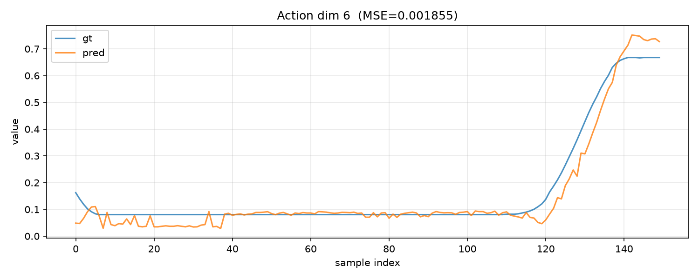

# Evaluation module: compare DreamZero checkpoints as a SageMaker job

> Evaluating a DROID checkpoint? Pass `--embodiment-tag oxe_droid` to
> `submit_eval_job.py` (default is `yam`, the GEAR bimanual embodiment) —
> the tag selects the transform stack the policy loads, and a wrong tag
> mis-normalizes every action without erroring.

Runs open-loop evaluation of up to 3 checkpoints on the **same deterministic
frame set** and writes per-arm MSE (per-dimension + per-key) to S3. Uses the
SageMaker training-job API purely as managed-GPU orchestration — the job runs
inference only (`torch.inference_mode`, no weight updates). This is the same
container as training, so there is no separate environment to maintain.

```bash
python3 submit_eval_job.py \
    --dataset-s3  s3://<bucket>/sagemaker/datasets/mydata/ \
    --arm finetuned=s3://<bucket>/sagemaker/models/mymodel-merged/ \
    --arm base=s3://<bucket>/sagemaker/checkpoints/DreamZero-AgiBot/:base \
    --config-donor s3://<bucket>/sagemaker/models/mymodel-merged/ \
    --results-s3  s3://<bucket>/sagemaker/eval-results/myrun/
# first: aws s3 cp run_eval_in_job.sh + open_loop_eval.py to <s3_root>/eval-assets/
```

The robot layout (state/action slices, cameras) is read from the dataset's
`meta/modality.json` — written by the prep stage from your embodiment config —
so eval always slices ground truth exactly the way training did. If a
checkpoint's predicted widths don't match that layout, the arm fails loudly
instead of reporting a meaningless MSE.

## Checkpoint-portability gotchas (handled by `run_eval_in_job.sh`)

Each cost us a failed job; the runner fixes all three automatically:

1. **Bare HF repo ids** — some configs name a component `"Wan-AI/Wan2.1-…"`
   rather than giving a path, and the repo resolves that relative to the working
   directory. The runner symlinks those ids to the mounted channels.
2. **Component paths that don't exist here** — a checkpoint records the
   frozen-component paths (T5/CLIP/VAE) from *its own* training environment, and
   some store `null`. Either way the DreamZero repo's `ensure_file()` falls back
   to downloading from the HuggingFace hub — a code-level fallback no symlink can
   intercept, and fatal in an offline container. The runner rewrites every
   component path that is null *or does not resolve locally* to its channel, so
   it works regardless of where the checkpoint was trained.
3. **Base checkpoints lack your embodiment** — a never-fine-tuned base has no
   transforms/stats for your robot (`KeyError` at load). Mark such arms
   `:base` and pass `--config-donor <your fine-tuned ckpt>`: the runner
   composes the donor's `config.json` + `experiment_cfg` over the base's
   weight shards — the identical composition LoRA training itself uses.

## Reading the results

`<results>/<arm>/mse.txt` has `overall_mse`, per-key, and per-dimension rows;
per-dimension pred-vs-gt plots ship alongside. Example (fine-tuned checkpoint,
one action dimension — prediction tracks the motion, not just the mean):



**Interpretation caveat (important):** open-loop MSE measures *imitation on
ground-truth states*. If your action labels lead the state by only a few
frames, a model that merely echoes the current state scores deceptively well —
open-loop MSE then cannot distinguish real learned behavior from that
degeneracy. Use this metric to (a) confirm fine-tuning beats the base by a
large factor and (b) catch broken checkpoints; treat **closed-loop rollouts**
(simulator or robot) as the deciding test between similar checkpoints.

## Alternative: run on any GPU instance

For rapid iteration (each SageMaker attempt pays a queue + channel-download
cost), the identical evaluation runs on any Docker-equipped GPU instance with
80GB+ VRAM — sync the same S3 prefixes down, bind-mount them at the
`/opt/ml/input/data/<channel>` paths `run_eval_in_job.sh` expects (wan,
tokenizer, dataset, evalscript, plus one mount per model arm), set the same
`ARMS`/`RESULTS_S3_URI` environment variables, and run the script inside the
training image. Same image, same results.
